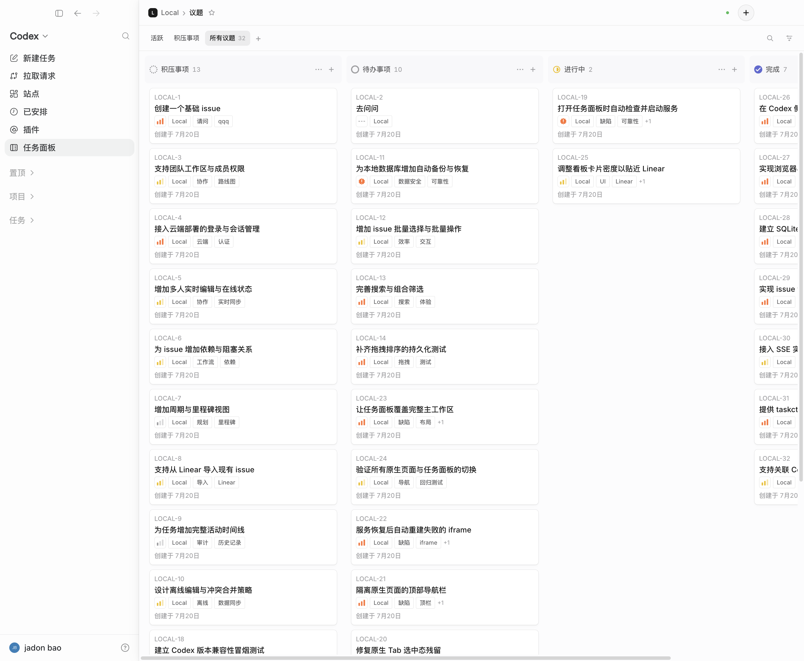
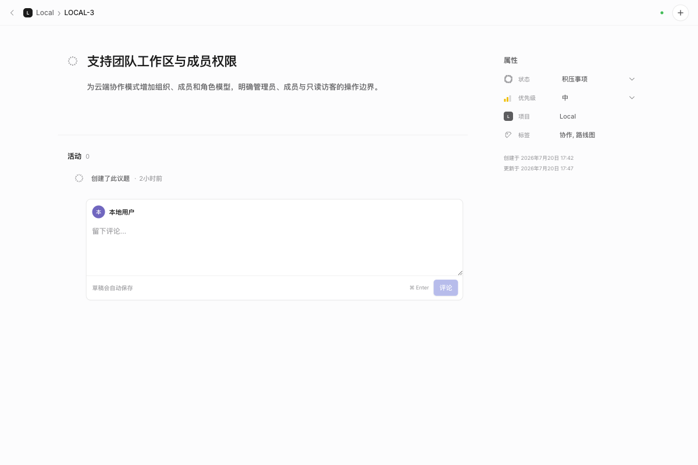

# Codex Taskboard（Codex 任务面板）

Codex Taskboard 是一个本地优先的项目与议题看板，可独立运行在浏览器中，也可嵌入 Codex 桌面端侧边栏。Web 界面、`taskctl` CLI 和随项目提供的 `manage-taskboard` Skill 共用同一套 HTTP API，让人和 Codex Agent 在同一份任务数据上协作。

## 界面预览

### Codex 内嵌看板



### 新建议题


### 议题详情



## 核心功能

- **项目管理**：新增本地项目并同步到 Codex；支持设备本地别名、收藏、拖动排序、归档与恢复，不修改实际目录名称。
- **议题看板**：按积压、待办、进行中、审核中、已阻塞、完成、已取消等状态管理议题；支持拖动排序、列顺序调整、隐藏列和空列保留。
- **搜索与筛选**：可按标题、编号、状态、优先级、标签、负责人、项目和关联会话筛选；支持跨项目总览。
- **议题详情**：支持 Markdown 描述、评论、附件、优先级、标签、负责人、截止日期、重复规则、开发分支或 worktree，以及父子、阻塞和相关关系。
- **收藏与草稿**：收藏常用议题，以列表或看板查看；新建议题可先保存到草稿箱。
- **Codex / Claude 协作**：从议题或评论创建、关联并打开 Codex 会话；本地环境可从议题启动 Claude Code 会话。议题保留当前会话和历史会话关联。
- **Agent 工作流**：`manage-taskboard` Skill 让 Agent 按认领、实现、验证、送审的流程处理议题；所有写操作都记录对应 Codex 会话。
- **流程与自动化**：项目可配置工作流，并通过 Codex 自动化定时认领待办议题。
- **项目知识与 AI 对话**：在已映射的本地项目中分析工程、形成待确认的知识提案，并围绕当前项目或议题发起本地 AI 对话。
- **实时协作**：本地服务通过 Server-Sent Events 刷新所有已打开的看板；也可部署到 Cloudflare，通过 D1、R2 和 Basic Authentication 共享数据。

## 工作原理

```text
React 看板 / taskctl / manage-taskboard Skill
                    │
                    ▼
              HTTP API + SSE
                    │
          ┌─────────┴─────────┐
          ▼                   ▼
   本地 SQLite          Cloudflare D1 / R2
          │
          ▼
  Codex 注入器与会话桥接
```

本地模式下，数据默认写入 `.data/taskboard.sqlite`。浏览器和 Codex 内嵌页使用同一套 React 界面；`taskctl` 通过同一 API 读写项目、议题、关系和评论。注入器只负责在 Codex 中增加任务面板入口和建立原生会话桥接，不修改、替换或重新签名 Codex 应用文件。

## 环境要求

- Node.js 22.5 或更高版本
- npm
- macOS（仅 Codex 桌面端注入和 Dock 启动器需要；独立 Web 看板可在其他支持 Node.js 的系统运行）

## 快速开始

```bash
npm install
npm run build
npm start
```

打开 <http://127.0.0.1:47823>。

开发模式：

```bash
npm run dev
```

Vite 开发服务器运行在 <http://127.0.0.1:5173>，并将 API 请求代理到本地服务。

## 嵌入 Codex

### 推荐方式：安装持久 Dock 启动器

```bash
./scripts/install-macos-launcher.sh
```

安装器会保留官方 Codex 应用，仅将 Dock 入口替换为 **Codex Taskboard**。该入口以只监听 `127.0.0.1:9229` 的 CDP 启动 Codex，后台监督程序负责恢复任务面板；Codex 已运行时再次点击该入口，也可手动恢复面板。

首次安装后如果 Codex 已经打开，请退出一次，再从新的 Dock 入口启动。原 Dock 配置会备份到 `.data/com.apple.dock.before-codex-taskboard.plist`。

### 保留当前窗口，另开一个 Taskboard 窗口

```bash
open -n -a /Applications/ChatGPT.app --args \
  --remote-debugging-address=127.0.0.1 \
  --remote-debugging-port=9231 \
  --remote-allow-origins=http://127.0.0.1:9231 \
  --disable-features=LocalNetworkAccessChecks
```

新窗口出现后，在另一个终端执行：

```bash
CODEX_TASKBOARD_HOST=127.0.0.1 \
npm run codex:inject -- --port 9231 --open
```

注入器需要保持运行。若 `9231` 已被占用，请在两个命令中改用同一个空闲端口。

`LocalNetworkAccessChecks` 仅对这个专用 Codex 进程关闭，因为 `app://` 页面需要嵌入回环地址上的任务面板。任务面板服务仍绑定 `127.0.0.1`，不会因此向局域网开放。

### 其他启动方式

重启 Codex 并由独立启动器管理：

```bash
CODEX_TASKBOARD_HOST=127.0.0.1 npm run codex
```

向一个已经启用 CDP 的 Codex 实例注入：

```bash
npm run codex:inject -- --port 9229 --open
```

Codex 26.715.52143 的 Renderer CSP 会阻止普通 HTTP iframe。启动器会在新文档导航前启用 CDP CSP bypass，并等待任务面板真正加载完成。CDP 不向其他本机进程提供认证，因此启用期间只运行可信代码。

## 使用 `taskctl`

从仓库内运行：

```bash
npm run taskctl -- project create \
  --id my-project \
  --name "我的项目" \
  --workspace-path /absolute/path/to/repository

npm run taskctl -- issue create \
  --project my-project \
  --title "实现下一个功能切片" \
  --status todo \
  --priority high \
  --labels product,mvp
```

也可执行 `npm link`，将 `taskctl` 安装到当前 shell 的命令搜索路径。完整命令说明见 [`skills/manage-taskboard/references/cli.md`](skills/manage-taskboard/references/cli.md)。

在 Codex 中使用 Skill：

```bash
ln -s /absolute/path/to/codex-taskboard/skills/manage-taskboard \
  ~/.codex/skills/manage-taskboard
```

开启新会话后，可用 `$manage-taskboard ISSUE-ID` 让 Agent 处理指定议题。Skill 会读取最新议题和评论，以乐观版本认领任务，完成验证后送审；只有用户明确验收后才会标记完成。

## 配置

| 环境变量 | 默认值 | 作用 |
| --- | --- | --- |
| `CODEX_TASKBOARD_HOST` | `0.0.0.0` | HTTP 监听地址；设为 `127.0.0.1` 可禁用局域网访问 |
| `CODEX_TASKBOARD_PORT` | `47823` | 本地服务端口 |
| `CODEX_TASKBOARD_DATA_DIR` | `.data` | SQLite 数据目录 |
| `CODEX_TASKBOARD_URL` | `http://127.0.0.1:47823` | CLI 使用的 API 地址 |

默认的局域网模式没有账户认证：可信局域网内能访问该地址的人都可以读写任务数据。不要将本地服务直接暴露到公网。

## 云端协作

项目支持部署到 Cloudflare Worker：

- 静态资源与 API：Cloudflare Worker
- 业务数据：D1
- 附件：私有 R2 Bucket
- 访问控制：HTTPS Basic Authentication
- 设备本地能力：本地 companion 保留项目目录映射、Git/worktree、Skill 和 MCP 能力

云模式不会回退或双写本地 SQLite。部署、密码轮换、目录映射和一次性数据迁移步骤见 [`docs/cloud-collaboration.md`](docs/cloud-collaboration.md)。

## 验证

```bash
npm run check
```

该命令依次执行 TypeScript 类型检查、Web 生产构建和服务端、CLI、注入器等测试。

如需分别执行：

```bash
npm run typecheck
npm run build
npm test
```

## 数据与安全边界

- `.data/` 中的 SQLite、备份、日志和运行截图不会提交到 Git。
- 注入器只连接回环地址上的 Codex CDP，不修改官方应用包。
- 项目目录映射是设备本地配置，云端协作者可以使用不同的本地检出路径。
- 云端写入失败时不会静默回退到本地数据库，避免产生两份事实来源。

## 许可证

当前仓库尚未声明开源许可证。在添加许可证前，默认保留全部权利。
