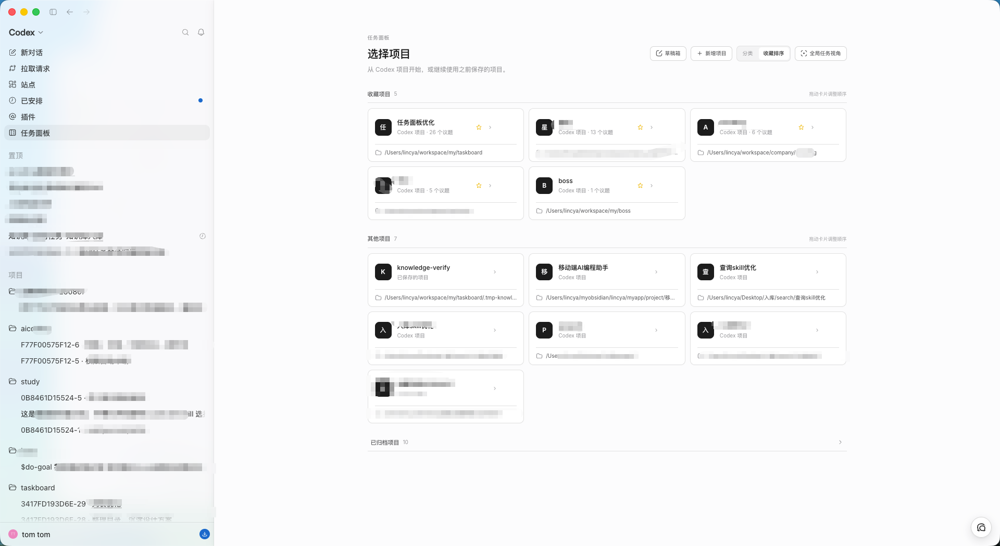
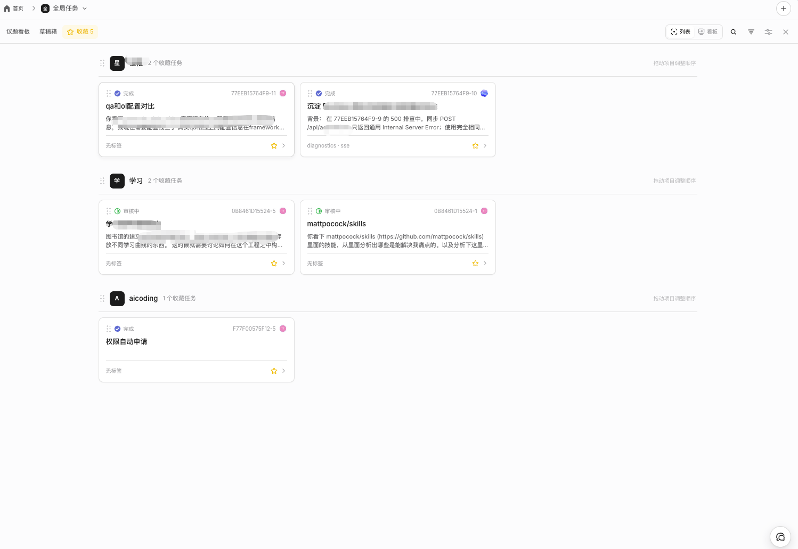
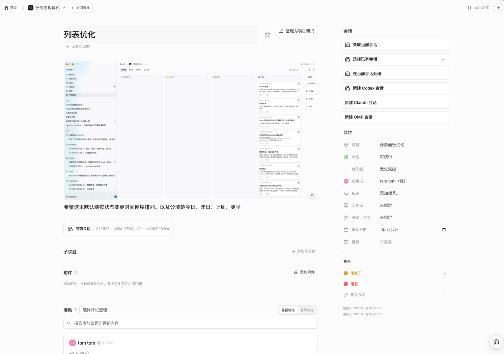
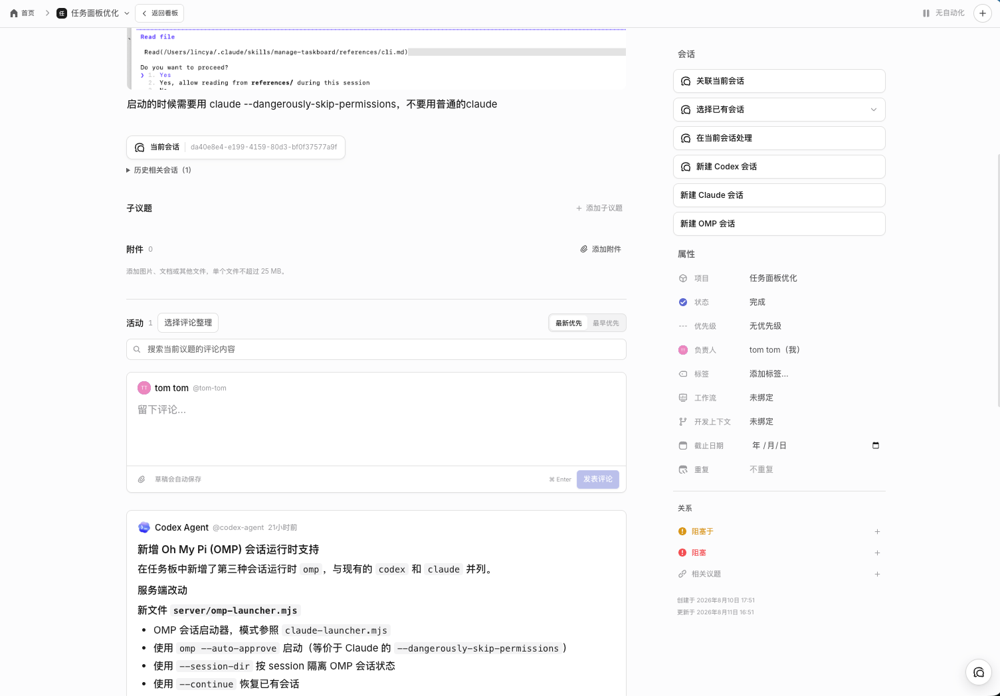
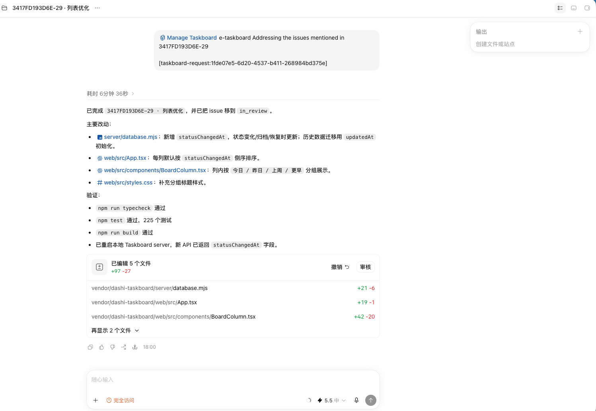

<p align="center">
  
</p>

<h1 align="center">Codex Taskboard</h1>

<p align="center">
  <strong>把 Codex、Claude Code、Oh My Pi 的任务、评论和会话统一收束到本地看板。</strong>
</p>

<p align="center">
  本地优先 · 可独立运行 · 可嵌入 Codex · 支持多 Agent 会话接力
</p>

<p align="center">
  <a href="README.md">English</a> · <a href="README_ZH.md">简体中文</a>
</p>

<p align="center">
  <a href="https://github.com/OhLuckyChen/codex-tasklist/stargazers"></a>
  = 22.5" src="https://img.shields.io/badge/Node.js-%3E%3D22.5-339933?logo=nodedotjs&logoColor=white">
  
  
  
</p>

> Codex Taskboard 是一个非官方的本地任务看板。它可以作为普通 Web 应用运行，也可以嵌入 Codex 桌面端。仓库已经移除云端协作后端，默认不依赖 Cloudflare Worker、D1、R2、Wrangler 或任何作者本机路径；议题、附件、日志和运行时元数据默认保存在本机 `.data/`。

## 它解决什么问题

AI 编程工具越来越多，但任务状态经常散在不同地方：一个需求在 Codex 里跑过，另一个评审点交给 Claude Code，某个后续验证又丢给 Oh My Pi。最后人要自己记住：

- 哪个任务正在做；
- 哪个任务卡住了；
- 哪条评论已经交给 Agent 跟进；
- 当前应该继续哪个会话；
- 历史会话里有哪些判断和证据；
- 一个项目里还有哪些任务需要评审或收尾。

Codex Taskboard 的定位是：不要让人追着会话跑，而是让 Codex、Claude Code、Oh My Pi 都围绕同一个 Issue 工作。

每个 Issue 都可以保存状态、优先级、标签、负责人、分支、worktree、本地项目路径、评论、附件、知识提案，以及当前和历史运行时会话。你可以从 Issue 或某条评论直接创建新的 Codex / Claude Code / Oh My Pi 会话，也可以把当前会话关联回 Issue，后续再点击会话标识跳回对应上下文。

## 核心功能

### 任务看板

- 多项目管理：创建项目、切换项目、设置别名、收藏项目、归档和恢复项目。
- 跨项目视图：把不同项目里的重要任务集中到全局任务和收藏视图。
- 状态流转：支持积压事项、待办事项、进行中、审核中、已阻塞、已完成、已取消、已归档。
- 任务属性：支持标题、描述、验收要求、标签、优先级、负责人、截止日期、重复规则、分支、worktree 和项目目录映射。
- 任务关系：支持父子关系、阻塞、被阻塞、相关任务。
- 版本保护：评论和议题更新使用版本号，降低多窗口或 Agent 并发写入时的覆盖风险。

### Agent 会话管理

| 运行时 | 支持能力 |
| --- | --- |
| Codex | 从 Issue 新建 Codex task；从评论新建 follow-up task；向当前 task 继续发送指令；关联或取消关联当前 task；查看当前和历史 task；点击 task 标识跳回 Codex。 |
| Claude Code | 从 Issue 或评论启动 Claude Code 会话；记录 Claude 会话 ID；通过本机终端恢复已关联会话。 |
| Oh My Pi / OMP | 从 Issue 或评论启动 OMP 会话；记录 OMP 会话 ID；通过本机终端恢复已关联会话。 |

会话链接分两层保存：

- Issue 当前会话：用于“继续这个任务”的主线会话。
- Issue 历史会话：保留所有曾经处理过该任务的运行时上下文。
- 评论级会话：适合把某一条评审意见、报错或补充要求单独交给 Agent 跟进。

### 评论、附件和证据

- Issue 描述和评论支持 Markdown。
- 评论可承载评审反馈、Agent 中间结论、验证记录和后续要求。
- 支持附件上传、下载、删除。
- 活动记录保留状态变化和关键操作，方便事后追踪。

### Codex 桌面嵌入

- 在 Codex 桌面端内打开 Taskboard 面板。
- 从 Taskboard 直接创建 Codex task。
- 把当前 Codex task 关联到 Issue。
- 从 Issue 详情页点击 task 标识跳回 Codex 对应会话。
- macOS 可安装 Dock 启动器，让 Codex 以带 Taskboard 注入能力的方式启动。

Codex 注入器只连接本机回环地址上的 CDP 端口，在 Codex 页面里增加 Taskboard 入口和 task 跳转能力。它不会修改、替换或重新签名官方 Codex 应用。

### Agent 自动化

仓库内置 `taskctl` CLI 和 `manage-taskboard` Skill，供 Agent 在执行任务时读写看板：

- 读取项目、Issue、评论和版本号；
- 认领任务；
- 追加评论和证据；
- 修改状态；
- 关联 Codex / Claude Code / OMP 会话；
- 把评审评论继续派发给新的会话。

### 项目知识

Taskboard 可以把 Issue 讨论、评论、实现证据整理成项目知识提案，人工确认后写入 `docs/knowledge/`。这部分面向本地项目沉淀，不依赖远端知识库服务。

## 界面预览

下面的截图来自真实使用界面；敏感内容由使用者手工打码，未重绘或伪造产品数据。

### 项目选择与 Codex 内嵌入口

在 Codex 侧边栏直接进入任务面板，选择已保存项目、收藏项目或其他本地项目。每个项目可绑定本地路径，后续 Issue、评论和 Agent 会话都会围绕该项目沉淀。



### 任务状态看板

Issue 按状态分列展示，支持待办、进行中、审核中、完成，以及右侧隐藏列。卡片里可以看到 Issue 编号、标题、摘要、收藏、评论和会话入口，适合按任务状态推进工作。


### 收藏列表

全局任务里的收藏视图可以把跨项目的重要 Issue 收拢到一个列表里，并按项目分组展示。适合集中处理评审项、待跟进问题和不希望散落在各项目看板里的重点任务。



### Issue 详情与多运行时会话

Issue 详情页集中承载描述、截图、属性、关系、附件、活动和评论。右侧会话区可以关联当前会话、选择已有会话、在当前会话处理，或新建 Codex、Claude Code、OMP 会话。



### 评论与 Agent 交接

评论区可以记录人工评审、Agent 结论和实现证据。Codex Agent 的输出会回写到 Issue 下，后续仍可从同一个 Issue 或评论继续派发 Codex、Claude Code 或 OMP 会话。



### 跳转回 Codex 会话

Taskboard 记录的 Codex 会话可以跳回对应任务页。这样 Issue 的状态、评论和实现过程能形成闭环：从看板派发任务，在 Codex 中执行，再把结果写回看板。



## 工作方式

```text
Web UI / Codex 内嵌面板 / taskctl / manage-taskboard Skill
                  |
                  v
          本地 Node.js HTTP API + Server-Sent Events
                  |
                  v
      SQLite + .data/attachments + 项目目录映射
                  |
                  v
       Codex / Claude Code / Oh My Pi 本机集成
```

典型流程：

1. 创建项目，或把项目映射到一个本地仓库路径。
2. 新建 Issue，补充描述、验收要求、标签、优先级、分支和 worktree。
3. 从 Issue 或某条评论启动 Codex / Claude Code / Oh My Pi。
4. Agent 执行后把结果、证据、阻塞点和会话 ID 写回 Issue。
5. 人工评审评论和变更；需要返工时，从评审评论继续创建 follow-up 会话。
6. 通过历史会话、活动记录和评论回看完整过程，确认后移动到完成。

## 安装要求

| 项目 | 是否必需 | 用途 |
| --- | --- | --- |
| Node.js >= 22.5 | 必需 | 运行服务端、CLI、构建脚本和测试。 |
| npm | 必需 | 通过锁文件安装依赖。 |
| Git | 推荐 | 克隆仓库、管理项目分支和 worktree。 |
| macOS | 可选 | 只有 Codex 桌面启动器、Dock 集成和本机终端恢复流程需要。 |
| Codex 桌面端 | 可选 | 需要内嵌 Taskboard、task 跳转和 Codex 会话桥接时使用。 |
| `codex` CLI | 可选 | 从 Issue 或评论创建 / 继续 Codex task。 |
| `claude` CLI | 可选 | 启动和恢复 Claude Code 会话。 |
| `omp` CLI | 可选 | 启动和恢复 Oh My Pi 会话。 |

最小可用形态只需要 Node.js 和 npm。没有 Codex、Claude Code 或 Oh My Pi 时，看板、Issue、评论、附件、项目知识和 `taskctl` 仍然可以正常使用；对应的运行时启动和恢复按钮不可用或需要配置可执行文件路径。

## 快速开始：独立 Web 看板

```bash
git clone https://github.com/OhLuckyChen/codex-tasklist.git
cd codex-tasklist
npm ci
npm run build:web
CODEX_TASKBOARD_HOST=127.0.0.1 npm start
```

打开 <http://127.0.0.1:47823>。

这里使用 `CODEX_TASKBOARD_HOST=127.0.0.1` 是为了只允许本机访问。默认监听地址是 `0.0.0.0`，适合需要局域网访问的场景，但不建议直接暴露到公网。

开发模式：

```bash
npm run dev
```

Vite Web 应用默认运行在 <http://127.0.0.1:5173>，API 请求会代理到本地 Taskboard 服务。

## 首次使用建议

1. 启动本地服务。
2. 在首页创建项目。
3. 在项目设置里映射本地仓库路径。
4. 新建 Issue，填写描述、验收要求、标签、优先级和开发上下文。
5. 如果需要 Agent 执行，从 Issue 或评论启动 Codex / Claude Code / OMP。
6. 执行结束后让 Agent 写回评论、证据和状态。
7. 人工确认后把 Issue 移动到审核中或完成。

## 嵌入 Codex 桌面端

macOS 推荐使用 Dock 启动器：

```bash
./scripts/install-macos-launcher.sh
```

安装器会执行这些操作：

- 检查 Node.js 版本是否满足 >= 22.5；
- 将当前 Node.js 路径记录到 `.data/node-path`；
- 如果能找到 `codex` CLI，将路径记录到 `.data/codex-path`；
- 安装 LaunchAgent：`io.github.ohluckychen.codex-taskboard.supervisor`；
- 将 Dock 当前配置备份到 `.data/com.apple.dock.before-codex-taskboard.plist`；
- 把 Dock 中的 Codex 入口替换为 Codex Taskboard 启动器。

如果 Codex 已经打开，首次安装后请退出一次，再从新的 Dock 图标启动。

也可以手动注入一个已经启用 CDP 的 Codex 实例：

```bash
npm run codex:inject -- --port 9229 --open
```

需要固定可执行文件路径时：

```bash
CODEX_TASKBOARD_NODE=/absolute/path/to/node \
CODEX_EXECUTABLE=/absolute/path/to/codex \
./scripts/install-macos-launcher.sh
```

## 配置运行时可执行文件

默认会通过 `PATH` 自动查找 `codex`、`claude` 和 `omp`。如果你的 CLI 不在默认路径里，可以显式配置：

```bash
CODEX_EXECUTABLE=/absolute/path/to/codex \
CLAUDE_EXECUTABLE=/absolute/path/to/claude \
OMP_EXECUTABLE=/absolute/path/to/omp \
CODEX_TASKBOARD_HOST=127.0.0.1 \
npm start
```

macOS Dock 启动器还会读取 `.data/node-path` 和 `.data/codex-path`。这两个文件由安装器生成，用来避免 GUI 应用拿不到 shell 里的 PATH。

## taskctl CLI

从仓库内运行：

```bash
npm run taskctl -- project create \
  --id my-project \
  --name "My Project" \
  --workspace-path /absolute/path/to/repository

npm run taskctl -- issue create \
  --project my-project \
  --title "Implement the next slice" \
  --status todo \
  --priority high \
  --labels product,mvp
```

也可以执行：

```bash
npm link
taskctl issue list --project my-project
```

完整命令见 [`skills/manage-taskboard/references/cli.md`](skills/manage-taskboard/references/cli.md)。

## 安装 Agent Skill

为 Codex 安装本地 Skill：

```bash
mkdir -p ~/.codex/skills
ln -s "$(pwd)/skills/manage-taskboard" ~/.codex/skills/manage-taskboard
```

在 Codex 中使用：

```text
$manage-taskboard ISSUE-ID
```

Skill 会先读取最新 Issue、评论和版本号，再通过 `taskctl` 写回认领、评论、状态流转和会话关联。这样可以避免 Agent 只凭旧上下文修改任务。

## 环境变量

| 环境变量 | 默认值 | 作用 |
| --- | --- | --- |
| `CODEX_TASKBOARD_HOST` | `0.0.0.0` | HTTP 监听地址。独立本机使用建议设为 `127.0.0.1`。 |
| `CODEX_TASKBOARD_PORT` | `47823` | HTTP 服务端口。 |
| `CODEX_TASKBOARD_DATA_DIR` | `.data` | SQLite、附件、日志和运行文件目录。 |
| `CODEX_TASKBOARD_URL` | `http://127.0.0.1:47823` | `taskctl` 访问的 API 地址。 |
| `CODEX_EXECUTABLE` | 自动探测 | Codex CLI 路径。 |
| `CLAUDE_EXECUTABLE` | 自动探测 | Claude Code CLI 路径。 |
| `OMP_EXECUTABLE` | 自动探测 | Oh My Pi CLI 路径。 |
| `CODEX_TASKBOARD_NODE` | 自动探测 | macOS 启动器使用的 Node.js 路径。 |

## 数据边界与独立分发

这个仓库当前满足本地独立运行的基本条件：

- 不包含 Cloudflare Worker、D1、R2、Wrangler 或云端协作迁移代码。
- 不需要作者本机路径、私有仓库路径或个人启动脚本。
- 运行时数据默认写入仓库内 `.data/`，不会提交到 Git。
- 附件默认写入 `.data/attachments`。
- 项目目录映射保存在 SQLite 项目记录里。
- `~/.codex/skills` 和 `~/.claude/skills` 只在用户主动安装 Skill 时使用。
- `/Applications/ChatGPT.app` 只用于 macOS Codex 桌面集成；独立 Web 看板不需要它。

注意：本地服务没有公网账户认证。需要远程访问时，建议通过可信内网、SSH 隧道或自建反向代理增加认证，不要把默认服务直接暴露到公网。

## 开发与验证

```bash
npm run check
```

这个命令会执行 TypeScript 类型检查、生产 Web 构建和 Node 测试。

也可以拆开执行：

```bash
npm run typecheck
npm run build
npm test
```

## 常见问题

| 问题 | 处理方式 |
| --- | --- |
| `npm ci` 报 Node 版本不满足 | 安装 Node.js 22.5 或更高版本，再重新执行 `npm ci`。 |
| 启动后访问不了页面 | 确认服务监听端口，默认是 `47823`；本机访问使用 <http://127.0.0.1:47823>。 |
| 端口被占用 | 设置 `CODEX_TASKBOARD_PORT=其他端口 npm start`。 |
| Web 能打开但无法读取项目文件 | 在项目设置中映射本地仓库目录，或执行 `taskctl project map PROJECT_ID --workspace-path /path/to/repo`。 |
| Codex 内没有 Taskboard | 确认从 Codex Taskboard Dock 图标启动，或手动运行 `npm run codex:inject -- --port 9229 --open`。 |
| 点击 Codex task 没有跳回会话 | 确认 Codex 是通过带 CDP 的启动方式打开，并且 task ID 已关联到 Issue。 |
| 点击 Claude / OMP 会话没有反应 | 确认本机安装了对应 CLI，或设置 `CLAUDE_EXECUTABLE` / `OMP_EXECUTABLE`。 |
| 局域网其他设备能访问 | 启动时设置 `CODEX_TASKBOARD_HOST=127.0.0.1`。 |
| 想换数据目录 | 设置 `CODEX_TASKBOARD_DATA_DIR=/absolute/path/to/data`。 |

## 文档入口

- [`changelog.md`](changelog.md)：重要变更记录。
- [`docs/knowledge/`](docs/knowledge/)：本地项目知识页。
- [`skills/manage-taskboard/references/cli.md`](skills/manage-taskboard/references/cli.md)：Agent Skill 使用的 CLI 文档。

## 许可证

当前仓库尚未声明开源许可证。在添加许可证前，默认保留全部权利。
