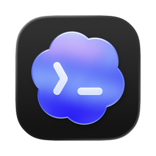
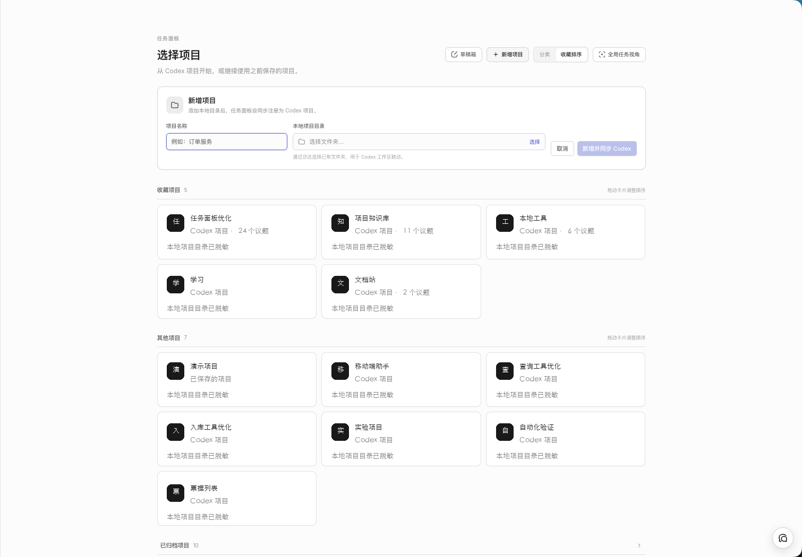
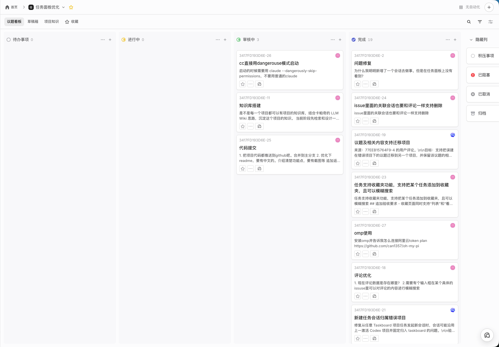
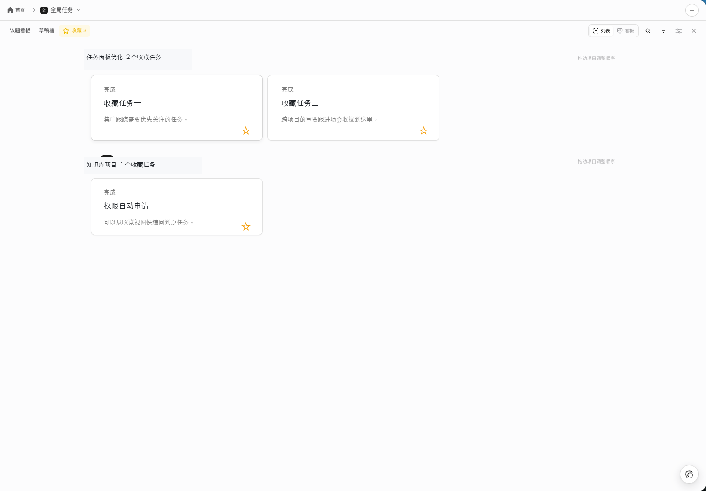
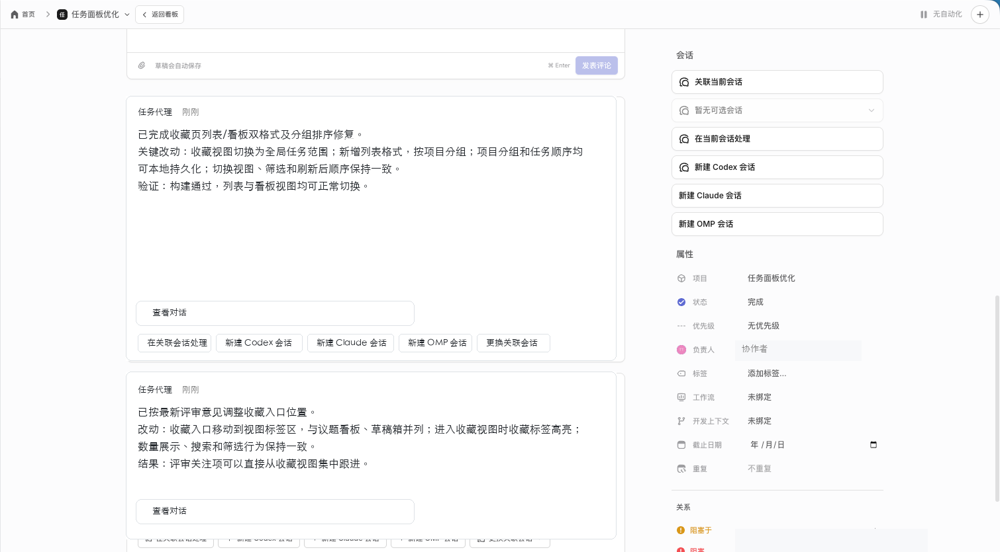
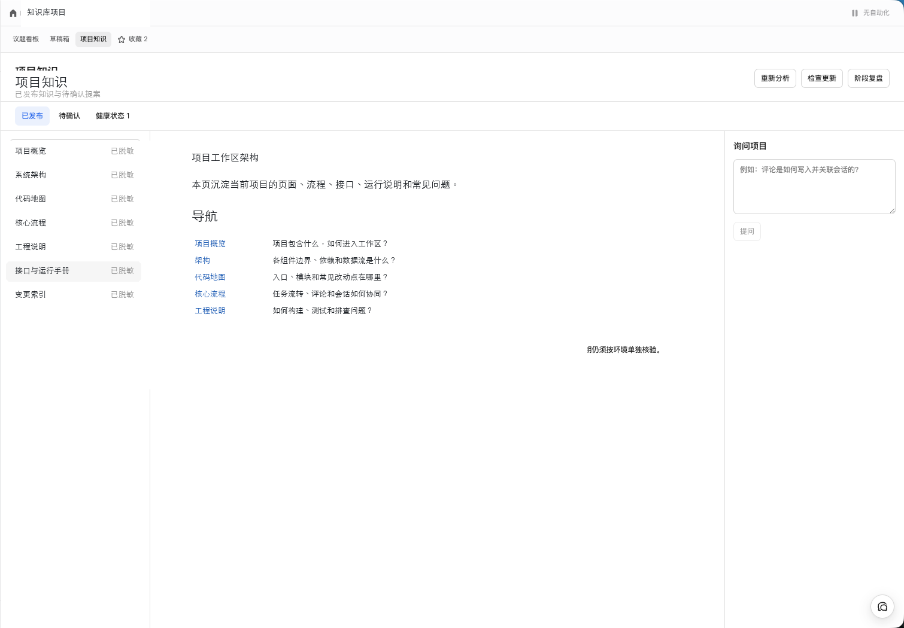
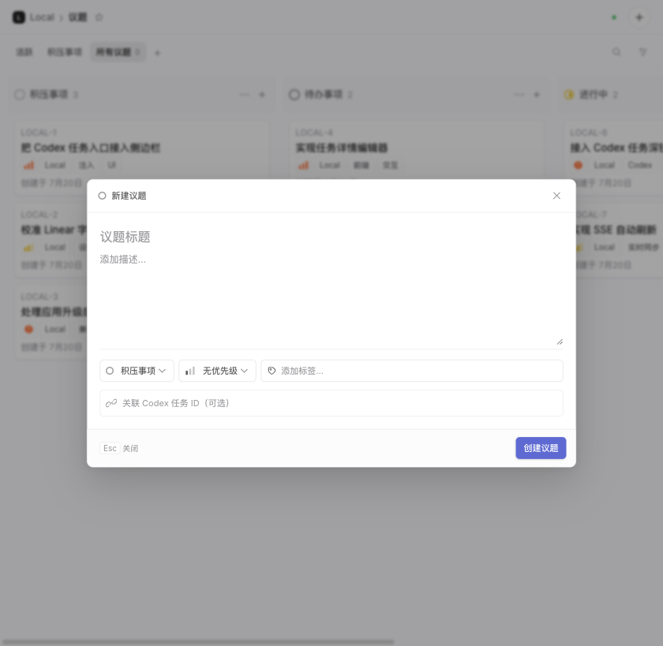
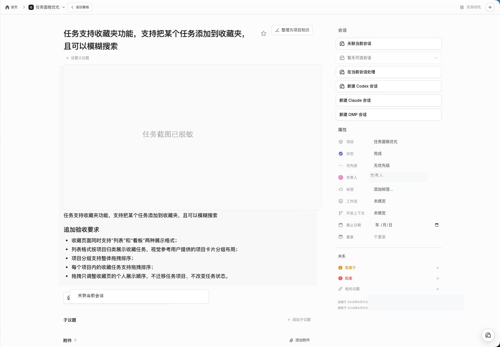

<p align="center">
  
</p>

<h1 align="center">Codex Taskboard</h1>

<p align="center">
  <strong>面向人和 Agent 协作的本地优先议题看板，可直接嵌入 Codex。</strong>
</p>

<p align="center">
  在一个本地工作区里管理项目、议题、评论、运行时会话和 Agent 交接。
</p>

<p align="center">
  <a href="README.md">English</a> · <a href="README_ZH.md">简体中文</a>
</p>

<p align="center">
  <a href="https://github.com/OhLuckyChen/codex-tasklist/stargazers"></a>
  = 22.5" src="https://img.shields.io/badge/Node.js-%3E%3D22.5-339933?logo=nodedotjs&logoColor=white">
  
  
</p>

> Codex Taskboard 可以作为普通 Web 应用独立运行，也可以嵌入 Codex 桌面端。仓库不包含托管协作后端：议题、附件、日志和运行时元数据默认保存在本机 `.data/`。

## 目录

- [为什么需要它](#为什么需要它)
- [工作流](#工作流)
- [功能](#功能)
- [界面截图](#界面截图)
- [运行方式](#运行方式)
- [安装要求](#安装要求)
- [快速开始](#快速开始)
- [首次使用](#首次使用)
- [嵌入 Codex](#嵌入-codex)
- [运行时会话](#运行时会话)
- [taskctl CLI](#taskctl-cli)
- [Agent Skill](#agent-skill)
- [配置](#配置)
- [数据与安全](#数据与安全)
- [开发与验证](#开发与验证)
- [常见问题](#常见问题)
- [文档与贡献](#文档与贡献)
- [许可证](#许可证)

## 为什么需要它

Codex Taskboard 的目标不是让人继续盯着每一个 AI 会话，而是把注意力从“会话进行到哪了”转移到“任务现在是什么状态”。

在真实项目里，同一批积压任务往往会被人、Codex、Claude Code 和 Oh My Pi 轮流处理。每个工具都会产生自己的会话、日志、评论和中间结论。如果这些信息分散在不同窗口里，人就需要不断追踪多个会话上下文，判断哪个任务在进行、哪个卡住了、哪个需要评审、哪个已经完成。

Codex Taskboard 把这些过程收束到任务本身：

- 以任务状态为中心管理积压事项、进行中、评审、阻塞和完成；
- 在同一个议题下关联 Codex、Claude Code、Oh My Pi 的当前会话和历史会话；
- 从议题或评论直接创建后续会话，让跨工具接力仍然围绕同一个任务展开；
- 用评论、附件和项目知识记录中间过程，保留关键判断、证据和上下文；
- 将沉淀下来的过程内容作为后续变更、评审和继续开发的支撑。

换句话说，它把 AI 协作从“人追着会话跑”改成“工具围着任务状态转”，减少人的注意力消耗，也让跨 Agent、跨会话的开发过程更容易管理和复用。

## 工作流

1. 创建项目，或把项目映射到一个本地仓库路径。
2. 新建议题，并填写标签、优先级、负责人、截止日期、分支和 worktree 上下文。
3. 从议题或评审评论启动 Codex、Claude Code 或 OMP 会话。
4. 让 Agent 更新状态、添加评论、附上证据，并关联自己的运行时会话。
5. 人工评审议题，必要时继续发送后续会话，完成后移动到完成状态。

## 功能

| 模块 | 支持能力 |
| --- | --- |
| 项目 | 多项目看板、跨项目总览、收藏项目、项目别名、归档与恢复。 |
| 议题 | 积压事项、待办事项、进行中、审核中、已阻塞、已完成、已取消、已归档等状态；草稿、收藏、优先级、标签、负责人、截止日期和重复规则。 |
| 评论与附件 | Markdown 描述、议题评论、附件下载、编辑、删除和版本冲突保护。 |
| 关系建模 | 父子、阻塞、被阻塞和相关议题关系。 |
| 开发上下文 | 每个议题可记录 Git 分支、worktree 路径和本地项目目录映射。 |
| 运行时会话 | 当前和历史 Codex、Claude Code、Oh My Pi 会话；支持评论级会话链接和后续会话入口。 |
| 本地自动化 | `taskctl` CLI 和 `manage-taskboard` Skill，供 Agent 认领任务、评论、移动状态并记录会话上下文。 |
| 项目知识 | 生成本地项目知识提案，审核后写入 `docs/knowledge/`。 |
| 实时界面 | 基于本地 HTTP API 和 Server-Sent Events 刷新多个浏览器窗口或 Codex 内嵌面板。 |

## 界面截图

下面这些截图覆盖主要功能面：项目管理、任务状态跟踪、收藏、Codex 内嵌、跨运行时会话操作、真实评审评论、项目知识库和议题上下文。

### 项目管理

从已保存项目开始，切换本地工作区，按分组查看活跃项目，进入全局任务视角，并在项目列表旁直接处理重命名、收藏和归档。



### 任务状态看板

用任务状态组织工作，而不是让人追着分散的会话跑。议题会停留在积压事项、待办、进行中、评审、完成、阻塞、取消和归档这些明确状态里。



### 收藏

把跨项目的重要任务收拢到一个聚焦视图里，紧急评审项和后续跟进不会散落在各个项目看板中。



### 嵌入 Codex

在 Codex 桌面端内从任务直接创建新会话，让任务状态和执行上下文在工作发生时保持可见。


### 评审评论与运行时会话

把真实评审反馈记录在评论里，同时保留当前与历史会话上下文，并能从同一个议题继续新建 Codex、Claude Code 或 Oh My Pi 会话。



### 项目知识库

将议题讨论、评论和实现证据整理成项目知识提案，再人工确认哪些内容应该沉淀为长期文档。



### 带上下文创建议题

新建议题时就记录状态、优先级、标签、负责人、开发上下文，并可关联 Codex task。



### 议题详情元数据

把议题详情页作为工作记录中心，集中承载描述、验收要求、附件、属性、活动记录和评审交接。



## 运行方式

```text
Web UI / Codex 内嵌面板 / taskctl / manage-taskboard Skill
                  |
                  v
          本地 Node.js HTTP API + SSE
                  |
                  v
      SQLite + .data/attachments + 项目目录映射
                  |
                  v
       Codex / Claude Code / Oh My Pi 本机集成
```

Codex 注入器只连接本机回环地址上的 CDP 端口，在 Codex 页面中增加 Taskboard 入口和 task 跳转能力。它不会修改、替换或重新签名官方 Codex 应用。

## 安装要求

| 项目 | 是否必需 | 说明 |
| --- | --- | --- |
| Node.js >= 22.5 | 必需 | 服务端、CLI、构建和测试都依赖 Node。 |
| npm | 必需 | 通过 `npm ci` 按锁文件安装依赖。 |
| macOS | 可选 | 只有 Codex 桌面启动器、Dock 集成和本机终端恢复流程需要 macOS。 |
| Codex 桌面端 | 可选 | 需要内嵌看板、task 跳转和 Codex 会话桥接时使用。 |
| `codex` CLI | 可选 | 用于从议题创建或继续 Codex 会话。 |
| `claude` CLI | 可选 | 用于启动和恢复 Claude Code 会话。 |
| `omp` CLI | 可选 | 用于启动和恢复 Oh My Pi 会话。 |

## 快速开始

```bash
git clone https://github.com/OhLuckyChen/codex-tasklist.git
cd codex-tasklist
npm ci
npm run build:web
CODEX_TASKBOARD_HOST=127.0.0.1 npm start
```

打开 <http://127.0.0.1:47823>。

开发模式：

```bash
npm run dev
```

Vite Web 应用默认运行在 <http://127.0.0.1:5173>，API 会代理到本地 Taskboard 服务。

## 首次使用

1. 启动本地服务。
2. 创建项目，或把已有项目映射到本地仓库路径。
3. 新建议题，并填写状态、优先级、标签、分支和 worktree 上下文。
4. 从议题启动或关联 Codex、Claude Code、OMP 会话。
5. 让 Agent 评论、附上证据、移动到评审状态，并把后续会话保留在同一个议题下。

## 嵌入 Codex

macOS 推荐安装 Dock 启动器：

```bash
./scripts/install-macos-launcher.sh
```

安装器会：

- 将当前 Node.js 路径记录到 `.data/node-path`；
- 如果能找到 `codex` CLI，会记录到 `.data/codex-path`；
- 安装 LaunchAgent，监听本地 Codex CDP 端口并恢复 Taskboard；
- 将 Dock 配置备份到 `.data/com.apple.dock.before-codex-taskboard.plist`；
- 把 Dock 中的 Codex 入口替换为 Codex Taskboard 启动器。

如果 Codex 已经打开，首次安装后请退出一次，再从新的 Dock 图标启动。

也可以手动注入一个已经启用 CDP 的 Codex 实例：

```bash
npm run codex:inject -- --port 9229 --open
```

需要固定可执行文件路径时：

```bash
CODEX_TASKBOARD_NODE=/absolute/path/to/node \
CODEX_EXECUTABLE=/absolute/path/to/codex \
./scripts/install-macos-launcher.sh
```

## 运行时会话

| Runtime | 支持流程 |
| --- | --- |
| Codex | 从议题新建 Codex 任务；从评论新建任务；向当前任务发送后续指令；关联或取消关联当前任务；查看当前和历史任务；点击任务标识跳回对应 Codex 任务。 |
| Claude Code | 从议题或评论启动 Claude Code 会话；记录 Claude 会话 ID；通过本机终端恢复已关联会话。 |
| Oh My Pi | 从议题或评论启动 OMP 会话；记录 OMP 会话 ID；通过本机终端恢复已关联会话。 |

会话链接分两层保存。议题级当前会话用于“继续当前任务”；历史会话用于追踪曾经处理过这个议题的运行时上下文。评论也可以独立关联会话，适合把某条评审意见交给单独的后续任务代理。

## taskctl CLI

从仓库内运行：

```bash
npm run taskctl -- project create \
  --id my-project \
  --name "My Project" \
  --workspace-path /absolute/path/to/repository

npm run taskctl -- issue create \
  --project my-project \
  --title "Implement the next slice" \
  --status todo \
  --priority high \
  --labels product,mvp
```

也可以执行 `npm link`，让 `taskctl` 出现在当前 shell 的命令搜索路径。完整命令见 [`skills/manage-taskboard/references/cli.md`](skills/manage-taskboard/references/cli.md)。

## Agent Skill

为 Codex 安装本地 Skill：

```bash
mkdir -p ~/.codex/skills
ln -s "$(pwd)/skills/manage-taskboard" ~/.codex/skills/manage-taskboard
```

在 Codex 中使用：

```text
$manage-taskboard ISSUE-ID
```

Skill 会先读取最新议题、评论和版本号，再通过 `taskctl` 写回认领、评论、状态流转和会话关联。

## 配置

| 环境变量 | 默认值 | 作用 |
| --- | --- | --- |
| `CODEX_TASKBOARD_HOST` | `0.0.0.0` | HTTP 监听地址。独立本机使用建议设为 `127.0.0.1`。 |
| `CODEX_TASKBOARD_PORT` | `47823` | HTTP 服务端口。 |
| `CODEX_TASKBOARD_DATA_DIR` | `.data` | SQLite、附件、日志和运行文件目录。 |
| `CODEX_TASKBOARD_URL` | `http://127.0.0.1:47823` | `taskctl` 访问的 API 地址。 |
| `CODEX_EXECUTABLE` | 自动探测 | Codex CLI 路径。 |
| `CLAUDE_EXECUTABLE` | 自动探测 | Claude Code CLI 路径。 |
| `OMP_EXECUTABLE` | 自动探测 | Oh My Pi CLI 路径。 |
| `CODEX_TASKBOARD_NODE` | 自动探测 | macOS 启动器使用的 Node.js 路径。 |

默认监听 `0.0.0.0` 是为了允许局域网设备访问。这个本地服务没有公网账户认证，不要直接暴露到公网。

## 数据与安全

- `.data/` 不提交到 Git，里面包含 SQLite、附件、日志、安装器记录的本机可执行文件路径和 Dock 备份。
- 项目目录映射保存在 SQLite 的项目记录中。
- `~/.codex/skills` 和 `~/.claude/skills` 是用户级 Agent 集成目录，只在你选择安装 Skill 时使用。
- `/Applications/ChatGPT.app` 是 Codex 桌面集成在 macOS 上使用的默认位置；只运行 Web 看板时不需要它。
- 仓库不再包含 Cloudflare Worker、D1、R2、Wrangler 或云端协作迁移代码。

## 开发与验证

```bash
npm run check
```

这个命令会执行 TypeScript 类型检查、生产 Web 构建和 Node 测试。

也可以拆开执行：

```bash
npm run typecheck
npm run build
npm test
```

## 常见问题

| 问题 | 处理方式 |
| --- | --- |
| `npm ci` 报 Node 版本不满足 | 安装 Node.js 22.5 或更高版本。 |
| Web 能打开但无法读取项目文件 | 在项目设置中映射本地仓库目录，或执行 `taskctl project map PROJECT_ID --workspace-path /path/to/repo`。 |
| Codex 内没有 Taskboard | 确认从 Codex Taskboard Dock 图标启动，或手动运行 `npm run codex:inject -- --port 9229 --open`。 |
| 点击 Claude/OMP 会话没有反应 | 确认本机安装了对应 CLI，或设置 `CLAUDE_EXECUTABLE` / `OMP_EXECUTABLE`。 |
| 局域网其他设备能访问 | 启动时设置 `CODEX_TASKBOARD_HOST=127.0.0.1`。 |

## 文档与贡献

- [`changelog.md`](changelog.md) 记录重要变更。
- [`docs/knowledge/`](docs/knowledge/) 保存本地项目知识页。
- [`skills/manage-taskboard/references/cli.md`](skills/manage-taskboard/references/cli.md) 是 Agent Skill 使用的 CLI 文档。

## 许可证

当前仓库尚未声明开源许可证。在添加许可证前，默认保留全部权利。
