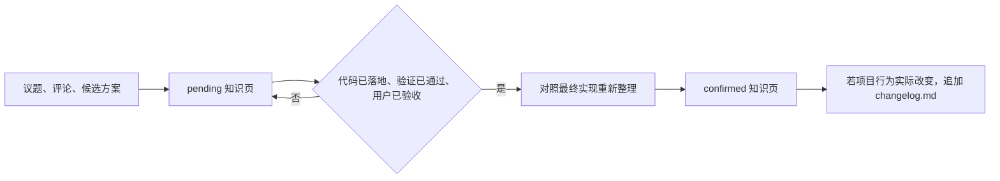
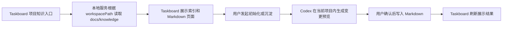

# 项目知识库基础方案

## 1. 方案结论

e-taskboard 中每个已映射本地目录的项目，都可以有一套随项目仓库维护的 Markdown 知识库。

这套知识库不是另外建一个大系统，也不是只放一个汇总文件。它需要解决四个基本问题：

1. 新人或 Codex 能快速理解项目是什么、代码在哪里、核心流程怎么走；
2. 议题、评论、改造方案和实施结果中的有价值内容不随会话消失；
3. 已验证的结论与待确认方案严格分开；
4. 项目发生真实改变时，继续用现有 `changelog.md` 记录时间线。

第一版不引入向量数据库、知识图谱、独立存储服务或后台自动更新任务。

## 2. 内容模型

项目知识分为四类。

| 类别 | 解决什么问题 | 内容来源 | 是否已确认 |
|---|---|---|---|
| 项目概览 | 项目是什么、如何启动、有哪些核心能力 | README、配置、启动入口 | 是 |
| 工程知识 | 架构、代码地图、核心链路、工程约定和易错点 | 源码、配置、测试、Git 历史 | 是，但必须有代码证据 |
| 已确认方案 | 为什么改、最终怎么改、验证结果是什么 | 已验收议题、评论、代码 diff、验证结果 | 是 |
| 待确认内容 | 尚未完结的方案、问题和假设 | 进行中议题、评论、分析结论 | 否 |

`changelog.md` 不是第五类知识正文。它只回答“项目什么时候真正改了什么”，与已确认方案中的原因、设计和边界互补。

## 3. 目录结构

```text
docs/knowledge/
├── index.md
├── project-overview.md
├── engineering/
│   ├── architecture.md
│   ├── code-map.md
│   ├── key-flows.md
│   └── conventions-and-gotchas.md
├── confirmed/
│   └── <issue-identifier>-<topic>.md
└── pending/
    └── <issue-identifier>-<topic>.md

changelog.md
```

### 3.1 `index.md`

这是人和 Codex 进入知识库后第一个读取的文件，包含：

- 项目一句话概述；
- 工程知识导航；
- 已确认方案列表；
- 待确认内容列表；
- 最后一次整理时间。

当创建、移动或删除知识页时，同步更新 `index.md`。

### 3.2 工程知识

- `project-overview.md`：项目目标、主要用户、功能、技术栈、启动和验证方式；
- `architecture.md`：前端、本地服务、CLI、数据存储、云端协作之间的职责和边界；
- `code-map.md`：主要目录、入口文件和模块职责；
- `key-flows.md`：重要用户操作的入口 → API → 数据变更 → 可见结果；
- `conventions-and-gotchas.md`：项目已有的开发约定、运行方式、容易踩坑的点和已确认的限制。

这些文件由项目代码初始分析生成，不是把目录树和函数列表简单复制进去。

### 3.3 已确认与待确认

一个具有长期价值的议题形成一个独立页面，例如：

```text
confirmed/3417FD193D6E-5-issue-status-transition.md
pending/3417FD193D6E-11-project-knowledge-base.md
```

小修复、文案调整和不具备复用价值的议题不强制生成知识页，避免知识库变成议题备份。

## 4. 页面最小格式

知识页仅保留能帮助追溯的最小元数据：

```yaml
---
title: 议题状态流转
updated_at: 2026-08-06
issue: 3417FD193D6E-5
sources:
  - web/src/App.tsx
  - server/app.mjs
---
```

- `issue` 只在页面来自议题时使用；
- `sources` 可以是源码、配置、测试、议题或外部原始资料；
- 不增加信心分、版本哈希、负责人等第一版不需要的字段；
- 是否已确认由 `confirmed/` 或 `pending/` 的目录位置表达，不再重复增加 status 字段。

### 4.1 已确认方案页

正文固定回答：

1. 背景和原问题；
2. 最终确认的方案；
3. 真正落地的代码链路；
4. 验证方式和结果；
5. 已知边界和注意事项；
6. 相关议题和关键评论。

### 4.2 待确认页

正文固定回答：

1. 背景和已知事实；
2. 当前候选方案；
3. 尚未确认的问题；
4. 要进入已确认目录需要满足的条件；
5. 相关议题和评论。

## 5. 知识来源与沉淀方式

### 5.1 现有代码初始分析

项目首次初始化知识库时，Codex 读取：

- `AGENTS.md` / `CLAUDE.md` 和 README；
- 包管理、构建、启动和环境配置；
- 代码目录和主要入口；
- API 路由、数据库结构、本地与云端边界；
- 核心测试和已有技术文档；
- 现有 `changelog.md` 中已经发生的重要变更。

有源码或文档证据的结论进入工程知识；无法证实的内容生成 `pending/` 页面，不写成已确认事实。

### 5.2 从评论沉淀

评论是知识来源，但不是整段复制到 Markdown。

每条评论增加“沉淀为项目知识”操作，触发后：

1. 带上当前议题描述、选中评论和现有知识索引；
2. Codex 提取其中的事实、方案、决策或注意事项；
3. 用户先看到将要新增或修改的页面预览；
4. 确认后写入 `pending/` 或已完结项目的 `confirmed/`；
5. 同步更新 `index.md`。

多条评论共同构成一个方案时，在议题详情中可多选评论后一次整理。

### 5.3 从整个议题沉淀

议题详情增加“整理本议题知识”操作，输入包括：

- 议题描述和附件；
- 选中的有价值评论；
- 与议题相关的代码 diff；
- 验证结果；
- 用户是否已经明确验收。

议题尚未验收时，整理到 `pending/`；验收后才可整理或晋升到 `confirmed/`。

## 6. 待确认到已确认的流转



晋升必须同时满足：

1. 最终实现与页面中的方案一致，如不一致必须先更新页面；
2. 验证结果已记录；
3. 用户已明确验收，不以 Codex 自验代替；
4. 尚未确认的边界已经删除、标注或继续留在 `pending/`。

晋升时从 `pending/` 移入 `confirmed/`，不在两个目录保留两份相同正文。`changelog.md` 只记录已经实际发生的变更。

## 7. Taskboard 产品入口

### 7.1 项目知识视图

在项目顶部“议题看板”同级增加“项目知识”视图。

页面使用简单的两栏布局：

- 左侧：项目概览、工程知识、已确认方案、待确认内容、Changelog；
- 右侧：Markdown 正文，支持打开内部页面、源码路径和相关议题；
- 顶部：“初始化知识库”“重新分析项目”“打开文件目录”三个操作。

未映射本地目录的项目只显示映射提示，不读写其他工作区。

### 7.2 议题和评论入口

- 评论操作：“沉淀为项目知识”；
- 议题操作：“整理本议题知识”；
- 待确认页操作：“对照最终实现并晋升”。

每次写入前先展示目标文件和内容摘要，由用户确认后再修改项目文件。

## 8. 最小读写链路

e-taskboard 已经具备可复用的基础：

- `web/src/App.tsx` 已有项目视图切换区；
- `server/app.mjs` 已能根据项目映射解析本地工作区；
- `server/ai-chat.mjs` 和 `server/ai-chat-catalog.mjs` 已能在项目工作区内运行 Codex 会话。

第一版只新增最小链路：



服务端只需要：

1. 读取知识目录和 Markdown 页面；
2. 校验页面路径不能逃出当前项目的 `docs/knowledge/`；
3. 将初始化、评论沉淀、议题整理和晋升操作交给当前项目的 Codex 会话；
4. 操作完成后刷新文件。

知识正文不写入 Taskboard SQLite，不新增项目知识专用数据表。知识文件通过 Git 跟随项目协作。

## 9. `changelog.md` 的边界

项目已有的 `changelog.md` 直接替代 Karpathy 方案中的 `log.md`，但不记录每次知识整理操作。

进入 `changelog.md` 的是：

- 用户可感知的功能变化；
- 重要调用链、数据或工程方式变化；
- 真实问题修复和验证结果；
- 需要为后续维护者保留的兼容性或边界变化。

不进入 `changelog.md` 的是：

- 仅创建或整理了知识页；
- 尚未实施的候选方案；
- 没有改变项目行为的普通讨论。

## 10. 第一版范围

### 包含

- 项目知识目录和页面模板；
- 基于现有代码的首次工程知识生成；
- Taskboard 项目知识视图；
- 评论沉淀和整项议题整理；
- `pending/` 与 `confirmed/` 分离；
- 用户验收后的知识晋升；
- 复用现有 `changelog.md`。

### 不包含

- embedding 和向量搜索；
- 知识图谱；
- 自动定时扫描代码；
- 页面 source hash 和级联过期计算；
- 无人确认的自动写入；
- 对每个小议题强制生成知识页。

## 11. 验收标准

1. 已映射目录的项目可以打开“项目知识”视图；
2. 初始化后能看到项目概览、架构、代码地图、核心链路和工程注意事项；
3. 工程知识中的服务、接口、数据和调用链有真实源码或文档支持；
4. 用户可将单条或多条评论整理为知识，且不是原样复制评论；
5. 进行中议题的方案只进入 `pending/`；
6. 代码落地、验证通过并经用户验收后，知识页可晋升到 `confirmed/`；
7. 真正改变项目行为的内容继续写入现有 `changelog.md`，知识整理操作本身不污染 changelog；
8. 所有知识写入前都有目标文件和内容预览，未经用户确认不写入项目文件。

## 12. 与 LLM Wiki 思路的关系

该方案保留 Karpathy LLM Wiki 最核心的思路：将代码分析、议题讨论和项目改造持续整理成可阅读、可链接、会积累的 Markdown 知识，而不是每次从头理解项目。

同时根据 e-taskboard 的实际场景做了收缩：先使用文件导航、工程知识、已确认/待确认分类和现有 changelog 完成主路径，实际规模证明不够时再考虑更复杂的检索和自动维护。

原始构想：[Karpathy: LLM Wiki](https://gist.github.com/karpathy/442a6bf555914893e9891c11519de94f)
