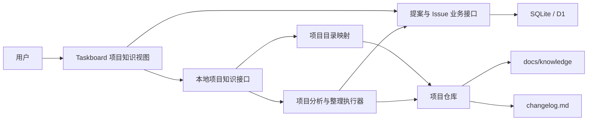
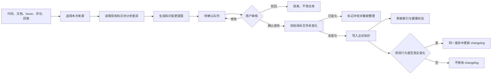
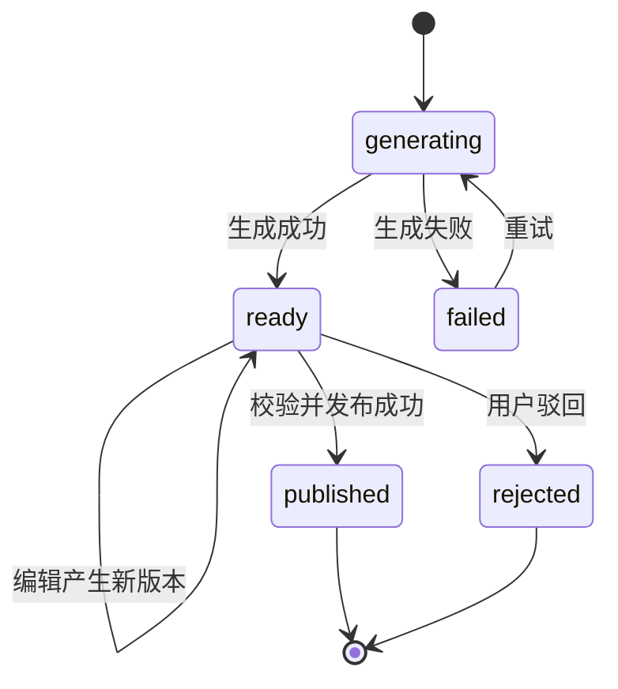

# 项目持续知识中心技术方案

> 文档状态：待评审
> 关联议题：3417FD193D6E-11

## 一、概述

### 1.1 背景

项目中真正有长期价值的信息分散在四处：

- 代码和配置中存在当前事实，但阅读成本高；
- Issue 与评论中存在问题背景、讨论过程和候选方案，但容易随任务结束沉没；
- 实施过程形成了最终决策、验证结果和经验，但通常没有回到长期文档；
- `changelog.md` 记录项目发生过什么变化，但不适合承载完整架构、代码地图和方案推导。

如果只维护一个大文件，它会很快混入待确认内容并变得难以阅读；如果为每个 Issue 建一个知识页，又会把知识库变成另一份任务档案。真正需要的是一条持续闭环：从项目事实和任务过程生成知识变更提案，经人确认后更新按主题组织的正式知识。

### 1.2 目标

在每个已映射本地目录的项目中提供“项目知识”能力，使用户可以：

1. 首次进入时，从现有代码、配置和文档建立项目基础认知；
2. 随时阅读项目概览、架构、代码地图、关键流程、决策和工程经验；
3. 从单条评论、多条评论或整个 Issue 中整理有长期价值的内容；
4. 清楚区分“已经确认并发布的知识”和“仍待确认的方案”；
5. 在发布前查看文件级差异，确认后才写入项目仓库；
6. 发现代码变化导致的知识过期，并生成定向更新提案；
7. 基于项目知识和当前代码提问，答案带来源，并可继续沉淀。

### 1.3 非目标

- 不把所有源码自动翻译成文档；
- 不把全部评论或每个小 Issue 强制沉淀；
- 不让未经确认的内容直接进入正式知识；
- 不使用知识图谱、向量数据库或独立检索服务作为默认依赖；
- 不用知识页替代源代码、正式业务文档或 Issue；
- 不把知识整理过程写进 `changelog.md`。

## 二、核心方案

### 2.1 三层模型

采用“仓库中的正式知识 + Taskboard 中的待确认提案 + 确定性新鲜度检查”三层模型。

| 层次 | 存放内容 | 存放位置 | 核心规则 |
| --- | --- | --- | --- |
| 正式知识 | 已确认的项目事实、架构、流程、决策和经验 | 项目仓库 `docs/knowledge/` | 按主题维护，受 Git 管理 |
| 待确认提案 | 初始化草稿、候选方案、评论整理结果、问答回写、过期修订 | Taskboard | 必须先看差异，再人工发布或驳回 |
| 项目变更时间线 | 已真实发生的重要功能和工程变化 | 项目现有 `changelog.md` | 只记录变化，不承载知识正文 |

这三层解决了两个容易冲突的问题：正式知识保持干净、稳定；未完成方案仍然能被保存、讨论和继续修改。

## 三、内容体系

### 3.1 正式知识目录

默认只生成少量核心页面，内容增长后再按主题拆分，避免初始化就产生大量空文件。

```text
docs/knowledge/
├── index.md
├── project-overview.md
├── architecture.md
├── code-map.md
├── key-flows.md
├── engineering-notes.md
├── designs/
│   └── <topic>.md
├── decisions/
│   └── <topic>.md
├── flows/
│   └── <topic>.md
└── guides/
    └── <topic>.md

changelog.md
```

- `index.md`：一句话概述、分类导航和最近一次正式知识更新时间；健康状态由 Taskboard 动态计算，不写入页面；
- `project-overview.md`：项目目标、用户、核心能力、技术栈、启动与验证；
- `architecture.md`：系统组成、职责边界、数据流和本地/云端关系；
- `code-map.md`：主要入口、目录和模块职责，以及“要改某类功能应该从哪里开始”；
- `key-flows.md`：最重要的用户操作链路；
- `engineering-notes.md`：开发约定、运行方式、限制、经验和易错点；
- `designs/`：已经实施、验证并确认，且值得长期维护的完整技术方案；
- `decisions/`：已经落地且有长期解释价值的方案决策；
- `flows/`：核心页面过长后拆出的专项流程；
- `guides/`：可复用的开发、排障和操作指南。

正式知识不再设置 `pending/` 和按 Issue 编号组织的 `confirmed/`。是否正式由“是否已经发布到仓库”表达；Issue 只作为来源和追溯入口。

### 3.2 页面元数据

每个知识页使用最小但足够支持追溯和新鲜度检查的元数据：

```yaml
---
id: architecture.system-overview
title: 系统总体架构
kind: architecture
updated_at: 2026-08-10
sources:
  - type: file
    ref: server/app.mjs
    revision: git-blob:<hash>
    symbol: createServer
  - type: issue
    ref: 3417FD193D6E-11
    revision: 8
---
```

字段说明：

| 字段 | 必要性 |
| --- | --- |
| `id` | 页面改名或移动后仍能稳定识别 |
| `title` | 人类阅读与搜索 |
| `kind` | 分类导航和模板约束 |
| `updated_at` | 展示最后整理时间 |
| `sources` | 追溯结论并执行新鲜度检查 |

文件来源优先记录当前工作区文件内容计算得到的 Git blob，而不是简单记录 `HEAD` 中的版本，因此未提交和未跟踪文件也能得到准确摘要；非 Git 项目记录 SHA-256。代码位置优先记录稳定的文件和符号，不把容易漂移的行号作为唯一定位依据。

### 3.3 内容状态

系统只向用户展示三个清晰状态：

| 状态 | 含义 | 用户动作 |
| --- | --- | --- |
| 已发布 | 已人工确认并写入项目仓库 | 阅读、提问、发起修订 |
| 待确认 | 已形成知识变更提案，但尚未发布 | 编辑、查看差异、发布、驳回 |
| 可能过期 | 已发布页面依赖的来源发生变化 | 查看变化、生成定向修订提案 |

“可能过期”表示需要复核，不等于知识一定错误。检查过程不得自动改写正式知识。

## 四、总体架构



### 4.1 职责边界

| 组件 | 职责 |
| --- | --- |
| Taskboard 前端 | 展示正式知识、待确认提案、健康状态、差异和问答入口 |
| Taskboard 业务接口 | 保存提案、来源快照、审核状态和操作人；本地与云端保持同一业务语义 |
| 本地项目知识接口 | 解析项目目录、读取 Markdown、检查来源、生成提案、执行发布 |
| 项目分析与整理执行器 | 读取限定来源，形成结构化的文件变更提案，不直接发布 |
| 项目仓库 | 保存正式知识和真实变更时间线，通过 Git 提供历史与协作 |

### 4.2 现有能力复用依据

- 项目页已有“议题看板 / 草稿箱 / 节点模式”的同级视图入口，新增“项目知识”不需要改变导航层级；
- 项目已经维护本机目录映射，并能解析 Git 根目录和工作上下文；
- 议题详情已经具备评论菜单、多评论列表、关联会话和附件上下文；
- 本地服务已经区分普通业务接口与 `/api/local/` 设备能力；
- 本地模式使用 SQLite，云端模式使用 D1，正式知识文件仍只由本地 companion 访问。

对应实现基础集中在 `web/src/App.tsx`、`web/src/components/TaskDetail.tsx`、`server/app.mjs`、`server/database.mjs` 和 `cloud/src/index.mjs`。

## 五、完整工作流

### 5.1 总链路



### 5.2 节点说明

| 节点 | 做什么 | 产出 | 执行方式 | 是否支持增量 |
| --- | --- | --- | --- | --- |
| 来源选择 | 选择项目扫描、Issue、评论、过期页面或回答 | 不可变来源快照 | 纯脚本 | 是 |
| 差异分析 | 对照现有知识与当前实现，判断新建还是更新 | 页面级影响范围 | 项目分析 | 是 |
| 提案生成 | 生成一个或多个文件操作及摘要 | 待确认提案 | 项目分析 | 是 |
| 审核 | 展示来源、文件列表和行级差异，允许编辑 | 审核后的提案版本 | 人工操作 | 是 |
| 发布前校验 | 比较目标文件基础摘要和当前摘要 | 可发布或冲突 | 纯脚本 | 是 |
| 发布 | 写入所选文件并更新索引 | 正式知识 | 纯脚本 | 是 |
| 新鲜度检查 | 比较来源版本，检查断链与缺失引用 | 健康状态 | 纯脚本 | 是 |

## 六、核心场景设计

### 6.1 首次初始化

用户进入“项目知识”，在未初始化状态点击“分析项目”。

项目知识页默认使用项目的设备目录映射；当项目存在多个分支或 worktree 时，页面显示当前代码上下文并允许切换。初始化、检查、搜索和问答始终针对当前选中的同一上下文。

分析范围：

1. 项目规则、README 和已有技术文档；
2. 包管理、构建、启动和部署配置；
3. 前后端入口、路由、数据结构和主要模块；
4. 核心测试和 `changelog.md`；
5. 已存在的知识文件，避免覆盖人工内容。

产出不是直接创建文件，而是一份初始化提案。默认包含六个核心页面及 `index.md`，用户可以逐文件查看、编辑和取消勾选。确认发布后才创建 `docs/knowledge/`。

无法从代码或文档证实的内容必须放在提案的“尚待确认”说明中，不能写成正式事实。用户未补充证据前，该段内容不能随提案发布。

### 6.2 从评论和 Issue 沉淀

评论菜单新增“加入知识提案”；Issue 更多操作新增“整理本议题知识”。

- 单条评论：适合沉淀明确结论、经验或注意事项；
- 多条评论：进入选择模式，勾选若干评论后统一整理；
- 整个 Issue：包含描述、选中评论、附件元数据、关联实现差异和验证结果。

Issue 生成的提案继承该 Issue 已绑定的分支或 worktree；没有绑定时才使用项目默认目录。提案发布时必须重新解析到同一分支上下文，避免在实现分支分析、却把知识写到另一个 checkout。

系统先判断内容是否具有跨当前会话的长期价值，并优先更新已有主题页。只有现有页面无法合理承载时才新建页面。

方案类内容的发布条件：

1. 最终实现已经确定；
2. 实际代码与提案描述一致；
3. 验证结果已经记录；
4. 用户已明确确认结果。

未满足条件时，提案可以长期保留在“待确认”，但不能进入正式知识。项目事实、工程约定等非方案内容，在有明确源码证据并经用户确认后可以独立发布，不强制等待整个 Issue 完结。

### 6.3 提案审核与发布

审核页按以下顺序展示：

1. 本次提案要解决什么；
2. 来源 Issue、评论和代码文件；
3. 计划新建、修改或删除的文件；
4. 每个文件的行级差异；
5. 是否包含 `changelog.md` 变更；
6. 尚未确认的内容和发布阻断原因。

用户可以编辑提案正文、取消某个文件变更、驳回整个提案或确认发布。

生成提案时记录每个目标文件的基础摘要。发布时若文件已经被其他工具或用户修改，停止写入并显示冲突，不覆盖新内容。重新整理后生成新的提案版本。

### 6.4 新鲜度与定向更新

打开项目知识时只执行快速、确定性的检查，不自动发起内容分析：

- 文件来源：比较 Git blob 或 SHA-256；
- Issue 与评论来源：比较业务数据 `version`；
- 文档链接：检查目标页面或文件是否存在；
- 索引：检查是否存在未被 `index.md` 收录的正式页面。

发现变化后，页面标记为“可能过期”，并显示变化来源。用户点击“生成修订提案”后才分析差异；如果变化不影响结论，提案只刷新来源版本。如果结论已变化，则修改对应正文。

### 6.5 询问项目

“询问项目”遵循以下检索顺序：

1. 读取 `index.md` 确定相关主题；
2. 读取相关正式知识页；
3. 涉及当前行为时回查代码、配置或测试；
4. 返回结论并列出知识页和源文件引用。

回答默认不保存。用户点击“保存为知识提案”后，系统对照现有页面生成一份普通待确认提案，仍需经过差异审核和发布。

普通规模下使用标题、正文全文搜索和文件定位即可；只有实际页面数量和查询效果证明不足时，再评估语义索引，不作为当前架构前置依赖。

### 6.6 知识沉淀触发点

| 触发点 | 系统动作 | 产出 |
| --- | --- | --- |
| 项目尚未初始化 | 用户点击“分析项目”后读取代码、配置、文档和测试 | 初始化提案 |
| 用户选择单条或多条评论 | 结合 Issue 上下文提炼长期有效内容 | 评论知识提案 |
| 用户整理整个 Issue | 汇总描述、评论、代码差异和验证结果 | Issue 知识提案 |
| Issue 进入 `in_review` | 对照实际实现判断是否产生长期知识 | 新建或刷新待确认提案 |
| Issue 经用户验收进入 `done` | 使用最终实现和验证结果完成 Issue 复盘 | 可发布的最终提案 |
| 用户保存项目问答 | 对照现有主题页定位应更新内容 | 问答知识提案 |
| 来源变化或用户点击“检查更新” | 找出受影响页面并分析事实变化 | 过期知识修订提案 |
| 用户发起阶段复盘 | 汇总上次复盘后的完成 Issue 与代码变化 | 项目级复盘提案 |

所有触发点只生成或更新待确认提案，不直接发布正式知识。代码保存、普通页面打开和只读搜索不会启动内容整理任务。

### 6.7 Issue 与项目复盘

Issue 复盘对照原始问题、讨论方案、最终实现、验证结果和可复用结论，将内容分别归入：

- 完整技术方案：`designs/<topic>.md`；
- 当前架构：`architecture.md`；
- 代码职责：`code-map.md`；
- 核心与专项流程：`key-flows.md` 或 `flows/<topic>.md`；
- 工程约定和易错点：`engineering-notes.md`；
- 操作和排障方法：`guides/<topic>.md`；
- 关键决策：`decisions/<topic>.md`；
- 真实项目变化：`changelog.md`。

项目复盘以最近一次已发布复盘为检查点，批量检查后续完成的 Issue、代码变化、可能过期页面、重复内容和相互冲突的结论，最终仍生成一份统一差异提案。

处理已有知识时优先修改原主题页并合并重复内容。当前事实完全失效时从正文删除；具有历史价值的决策保留并标记为已被替代，同时链接到新决策。所有删除、替代和合并操作都必须经过差异审核。

## 七、产品交互

### 7.1 项目知识主页面

在项目顶部增加“项目知识”标签，与“议题看板”同级。

页面包含三个二级区：

| 区域 | 内容 | 主要操作 |
| --- | --- | --- |
| 已发布 | 分类目录、搜索、Markdown 正文、来源和更新时间 | 阅读、提问、发起修订 |
| 待确认 | 提案列表、来源、状态和文件差异 | 编辑、发布、驳回 |
| 健康状态 | 可能过期、断链、缺少来源、未收录页面 | 检查、生成修订提案 |

页面顶部只保留高频操作：“分析项目”“询问项目”“检查更新”。未映射目录时显示映射提示，不展示不可执行按钮。

如果项目存在多个可用分支或 worktree，顶部同时显示一个紧凑的“代码上下文”选择器。它默认跟随项目目录；从 Issue 进入时默认跟随 Issue 已绑定的开发上下文。

### 7.2 已发布区

- 左侧按内容类型展示页面目录；
- 右侧展示 Markdown 正文；
- 页面头部显示来源、新鲜度和最近更新时间；
- 源码引用可打开对应项目文件，Issue 引用可回到详情页；
- 搜索同时匹配标题和正文，不要求用户理解目录结构。

### 7.3 待确认区

- 列表卡片显示标题、来源类型、涉及文件数、创建人和更新时间；
- 默认优先显示等待审核和存在冲突的提案；
- 详情页使用文件树 + 差异视图；
- 允许直接编辑修改后的 Markdown；
- 发布、驳回和重新整理都有明确结果提示。

### 7.4 Issue 与评论入口

- Issue 操作：“整理为项目知识”；
- 评论操作：“加入知识提案”；
- 评论区操作：“选择多条并整理”；
- Issue 完成且存在重要实现变化时，显示一次非阻塞建议：“生成知识更新”。

完成 Issue 不自动写知识，提示也不阻断状态变更或自动创建提案。

## 八、数据模型

正式知识不写入 Taskboard 数据库。数据库只保存需要协作和审核的提案。

### 8.1 `knowledge_proposals`

| 字段 | 类型 | 说明 |
| --- | --- | --- |
| `id` | TEXT PK | 提案 ID |
| `project_id` | TEXT FK | 所属项目 |
| `title` | TEXT | 提案标题 |
| `source_type` | TEXT | `project_scan`、`issue`、`comments`、`question`、`stale_refresh` |
| `source_snapshot` | TEXT(JSON) | 本次使用的 Issue、评论、文件和版本快照 |
| `development_context_type` | TEXT NULL | `branch` 或 `worktree`；为空表示项目默认目录 |
| `development_branch` | TEXT NULL | 用于在不同设备解析同一代码上下文，不保存绝对路径 |
| `status` | TEXT | `generating`、`ready`、`published`、`rejected`、`failed` |
| `summary` | TEXT | 变更目的与影响摘要 |
| `error` | TEXT NULL | 生成失败原因 |
| `creator_type` | TEXT | 创建人类型 |
| `creator_id` | TEXT | 创建人 ID |
| `creator_name` | TEXT | 创建人名称快照 |
| `publisher_type` | TEXT NULL | 发布人类型 |
| `publisher_id` | TEXT NULL | 发布人 ID |
| `publisher_name` | TEXT NULL | 发布人名称快照 |
| `version` | INTEGER | 乐观并发版本 |
| `created_at` | TEXT | 创建时间 |
| `updated_at` | TEXT | 最后更新时间 |
| `published_at` | TEXT NULL | 发布时间 |

不单独建立来源表。来源只随提案用于追溯和重现，JSON 快照更符合其整体读取方式，也避免为不同来源类型增加大量空字段。文件来源快照只保存项目相对路径、符号和内容摘要，不把源码正文复制到 D1；Issue 和评论保存当时正文及版本，保证后续编辑后仍能还原提案依据。

### 8.2 `knowledge_proposal_changes`

| 字段 | 类型 | 说明 |
| --- | --- | --- |
| `id` | TEXT PK | 变更 ID |
| `proposal_id` | TEXT FK | 所属提案，删除提案时级联删除 |
| `target_path` | TEXT | 相对项目根目录的目标路径 |
| `operation` | TEXT | `create`、`update`、`delete` |
| `base_digest` | TEXT NULL | 生成提案时目标文件摘要；新建文件为空 |
| `before_content` | TEXT NULL | 审核差异使用的原内容 |
| `after_content` | TEXT NULL | 拟发布内容 |
| `sort_order` | INTEGER | 稳定展示顺序 |

`target_path` 只允许 `docs/knowledge/` 下的 Markdown 文件，以及项目根目录的 `changelog.md`。发布接口必须再次校验真实路径，拒绝绝对路径、`..` 和越界符号链接。项目没有 `changelog.md` 时默认不自动创建，只有用户在差异中明确确认后才可新建。

### 8.3 状态流转



发布中的短暂执行状态由请求本身表达，不持久化为业务状态。只有全部文件写入成功后才将提案标记为 `published`；失败时保持 `ready` 并返回具体错误。

## 九、接口设计

### 9.1 提案业务接口

这些接口在本地 SQLite 与云端 D1 保持一致。

| 方法 | 路径 | 用途 |
| --- | --- | --- |
| GET | `/api/projects/:projectId/knowledge-proposals` | 按状态列出项目提案 |
| POST | `/api/projects/:projectId/knowledge-proposals` | 保存本地生成流程产出的结构化提案 |
| GET | `/api/knowledge-proposals/:id` | 获取提案、来源和文件变更 |
| PATCH | `/api/knowledge-proposals/:id` | 修改标题、摘要、变更内容或驳回；要求 `version` |

创建和修改接口只接受结构化提案，并校验目标路径格式、操作类型和状态流转；发布状态不能通过普通业务接口直接写入。真正发布时，本地接口仍会基于项目真实路径重新校验，不能依赖客户端或云端保存的路径已经安全。

### 9.2 本地项目知识接口

这些接口只允许 loopback companion 调用，云端 Worker 不访问设备文件。

| 方法 | 路径 | 用途 |
| --- | --- | --- |
| GET | `/api/local/projects/:projectId/knowledge` | 获取初始化状态、目录、页面摘要和健康统计 |
| GET | `/api/local/projects/:projectId/knowledge/pages?path=...` | 读取单页 Markdown 与来源状态 |
| GET | `/api/local/projects/:projectId/knowledge/search?q=...` | 标题和正文搜索 |
| POST | `/api/local/projects/:projectId/knowledge/check` | 执行确定性健康检查 |
| POST | `/api/local/projects/:projectId/knowledge/generate` | 根据来源生成或重新生成提案 |
| POST | `/api/local/projects/:projectId/knowledge/ask` | 发起带来源的项目问答 |
| POST | `/api/local/projects/:projectId/knowledge/proposals/:id/publish` | 校验基础摘要并发布提案 |

`generate` 的来源参数采用一个统一结构：

```json
{
  "sourceType": "comments",
  "taskId": "task-id",
  "commentIds": ["comment-id-1", "comment-id-2"],
  "developmentContext": {
    "type": "worktree",
    "branch": "feature/project-knowledge"
  }
}
```

不同 `sourceType` 只接受其必要字段，服务端从业务数据和项目目录重新取得真实内容，不相信客户端提交的 Issue 正文、文件路径或发布结果。

## 十、本地与云端边界

### 10.1 本地模式

- 提案保存在本地 SQLite；
- 正式知识由本地服务读取和发布；
- 项目目录取自项目的 `workspacePath`。

### 10.2 云端协作模式

- 提案保存在 D1，两个协作者可以看到同一待确认队列；
- 每台设备继续使用自己的项目目录映射；
- 提案只同步分支或 worktree 的逻辑标识，不同步设备绝对路径；另一台设备发布前必须能在本机解析到同一分支；
- 正式知识通过 Git 在设备间同步，D1 中的提案及已发布差异只作为审核历史，不是正式知识的读取来源；
- 发布必须由具有有效项目映射的 loopback companion 执行；
- 直接打开云端网页时可以查看提案业务信息，但不能读取或发布本机知识文件，页面应提示连接本地 companion。

发布时，本地 companion 读取云端提案版本，完成文件校验和写入后再回写 `published` 状态。若云端提案版本在此期间发生变化，发布失败并要求刷新，避免两台设备基于不同内容同时发布。

## 十一、发布一致性与安全边界

1. 项目必须存在有效的本机目录映射；
2. Git 项目优先解析到当前映射所在的 Git 根目录，不跨项目猜测路径；
3. 提案绑定开发上下文时，读取、检查和发布必须使用同一分支；
4. 所有读取和写入路径经过绝对路径解析与真实路径校验；
5. 发布前一次性校验全部目标文件的 `base_digest`；
6. 新建操作若目标文件已经出现，同样按冲突处理；
7. 任一文件冲突时整次发布不开始写入；
8. 写入前保留本次涉及文件的原内容；发生中途错误时恢复已经替换的文件并报告失败；
9. 写入全部成功后才更新提案状态；
10. 不执行 Git commit、push、checkout 或分支切换；
11. 不覆盖生成提案之后用户对目标文件所做的新修改；
12. 问答和健康检查只读，不改变仓库；
13. `changelog.md` 只有在提案明确包含且用户勾选时才修改。

## 十二、主要改动点

### 12.1 前端

- `web/src/App.tsx`：增加 `knowledge` 项目视图和加载状态；
- `web/src/api.ts`、`web/src/types.ts`：增加知识页面、健康状态和提案接口类型；
- `web/src/components/TaskDetail.tsx`：增加 Issue、单评论和多评论整理入口；
- 新增项目知识主页面、页面阅读器、提案列表、差异审核和健康检查组件；
- `web/src/styles.css`：增加与现有 Taskboard 视觉体系一致的布局和状态样式。

### 12.2 本地服务

- `server/app.mjs`：增加本地知识接口和提案业务路由；
- `server/database.mjs`：增加本地提案表、查询和乐观并发更新；
- 新增知识仓库模块：负责目录解析、Markdown 元数据、全文搜索、新鲜度和发布；
- 新增知识整理模块：负责来源快照、提案生成和问答；
- 复用现有项目目录解析和本地项目会话能力，不建立第二套运行时。

### 12.3 云端

- 新增 D1 migration，表结构与本地 SQLite 对齐；
- `cloud/src/index.mjs` 增加提案查询和更新路由；
- 将提案变更纳入 `global_revision`，保证另一协作者能及时刷新；
- 云端不增加文件读取或发布接口。

## 十三、实施顺序与验收

实施按可独立体验的纵向链路推进，不先铺设大量外围能力。

### 阶段一：正式知识可读、初始化可审核发布

1. 项目知识入口和未初始化页面；
2. 正式知识目录、页面读取和展示；
3. 提案数据模型和待确认列表；
4. 项目初始化生成提案；
5. 文件差异审核和确认发布；
6. 使用 e-taskboard 自身完成一次初始化演示。

阶段验收路径：

> 项目页 → 项目知识 → 分析项目 → 查看初始化提案 → 审核文件差异 → 确认发布 → 页面立即展示正式知识。

### 阶段二：任务过程持续沉淀

1. 单条评论整理；
2. 多评论选择整理；
3. 整个 Issue 整理；
4. 方案完成条件检查；
5. 可选的 `changelog.md` 差异。

阶段验收路径：

> Issue 详情 → 选择评论或整理整项 → 生成待确认提案 → 更新已有主题页 → 审核发布 → 从知识页回到原 Issue。

### 阶段三：知识持续可用

1. 来源版本与确定性健康检查；
2. 过期页面定向修订；
3. 标题和正文全文搜索；
4. 带来源的项目问答；
5. 将有价值回答保存为待确认提案；
6. 云端提案同步和本地发布边界。

阶段验收路径：

> 修改已引用代码 → 健康检查标记页面可能过期 → 查看来源变化 → 生成修订提案 → 审核发布 → 页面恢复为最新。

### 13.4 验证要求

- 先在真实界面证明每个阶段的入口、操作、数据变化和可见结果；
- 用户确认主路径可用后，再补充该阶段已授权的针对性自动化验证；
- 运行 TypeScript 检查、前端构建和相关服务测试；
- 本地与云端提案接口保持同一状态语义；
- 使用临时项目验证越界路径、文件冲突和未映射项目，不修改其他真实项目；
- e-taskboard 自身知识初始化必须由用户审核后才正式写入。

## 十四、验收标准

1. 已映射项目可以打开“项目知识”，未映射项目得到明确提示；
2. 项目默认目录、Issue 分支和 worktree 上下文不会互相串写；
3. 初始化只生成待确认提案，不直接修改项目；
4. 用户能阅读项目概览、架构、代码地图、关键流程和工程经验；
5. 正式知识中的架构、接口、数据和调用链能够回到真实来源；
6. 单评论、多评论和整项 Issue 均可生成提案，且不会原样堆砌评论；
7. 未完成方案留在待确认队列，不能伪装成正式知识；
8. 提案优先更新主题页，不按 Issue 大量创建碎片文档；
9. 发布前能看到文件级与行级差异，并可编辑或取消单项变更；
10. 目标文件在提案生成后发生变化时，发布不会覆盖新内容；
11. 来源变化后可以确定性标记“可能过期”，但不自动改写正文；
12. 项目问答带知识页或代码来源，并可保存为普通待确认提案；
13. `changelog.md` 只记录真实项目变化，不记录知识整理动作；
14. 云端协作时提案可同步，项目文件仍只由本地 companion 访问；
15. e-taskboard 自身能够完成初始化、阅读、采集、审核、发布、检查和问答闭环。

## 十五、运行原则

项目知识采用明确的生命周期：

- 代码和文档提供事实；
- Issue、评论和实施结果提供上下文；
- Taskboard 保存尚未确认的知识变更；
- 人通过差异审核决定哪些内容成为正式知识；
- Git 保存正式知识的历史；
- `changelog.md` 继续只描述项目真实变化；
- 来源检查保证知识不会在代码变化后悄悄失真。

这套结构在日常使用上只有“查看、整理、审核、发布、检查、提问”六个动作，但底层保留了来源、状态、冲突和新鲜度边界，能够长期使用而不会退化成文档堆或评论备份。
